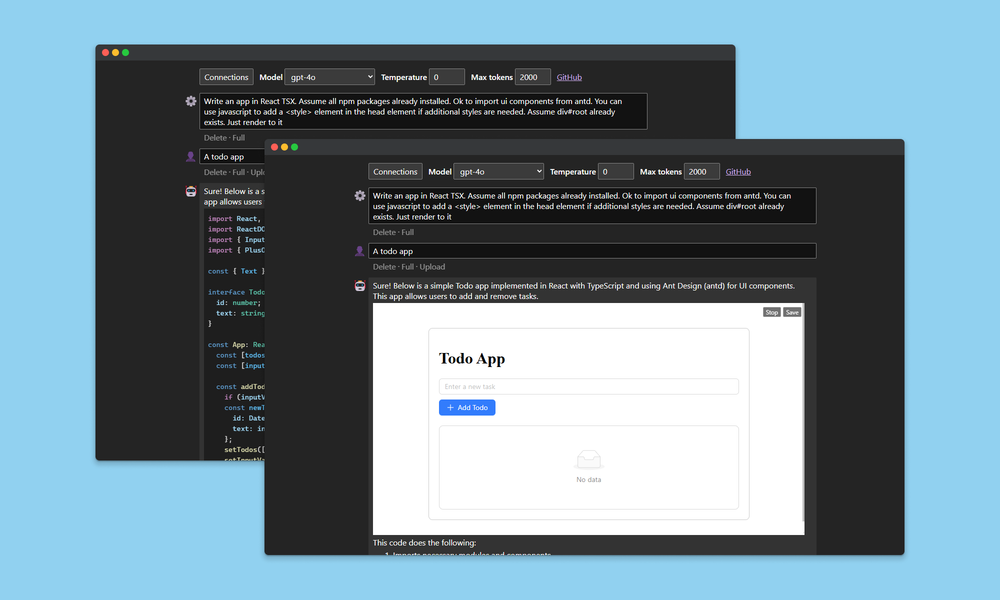
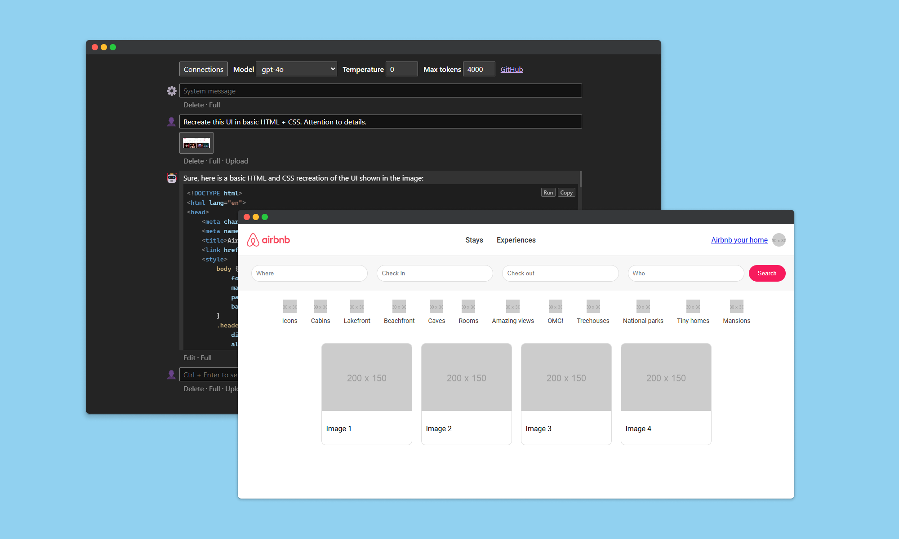

# Iter

A minimalist frontend for Gen AI Chat models, optimized for rapid prompt iteration.

- **🔒 Privacy first**: Credentials are stored in your browser. All requests directly sent to API with no middleman. Absolutely no tracking.
- **⚡ API endpoint and model hot-swap**: Switch between different APIs and models without losing any chat progress
- **🦉 Adapts to OS/Browser default theme**: Dark theme for happy night owls
- **💅 Markdown parser**: Built-in syntax highlight and copy button for code blocks
- **🧭 Artifacts**: Run code blocks for SVG, HTML, Mermaid, TypeScript, and React in JSX
- **💻 Interpreter**: Process uploaded files with TypeScript and any browser-friendly npm packages
- **📸 Vision input**: Handle visual inputs with multi-modal models
- **🎙️ Speech input**: Use microphone to input text that can be mixed with typed message

## Supported model providers

- OpenAI
  - ✅ o1-mini
  - ✅ GPT-4o
  - ✅ GPT-4o-mini
- Azure OpenAI
  - ✅ GPT-4o
  - ✅ GPT-4o-mini
- Anthropic
  - ✅ Claude 3.5 Sonnet
  - ✅ Claude 3.5 Haiku
- Google Generative AI
  - ✅ Gemini 2.0 Flash Experimental

## Screenshots

Create a runnable program from text

Recreate the UI of Airbnb with a single screenshot

