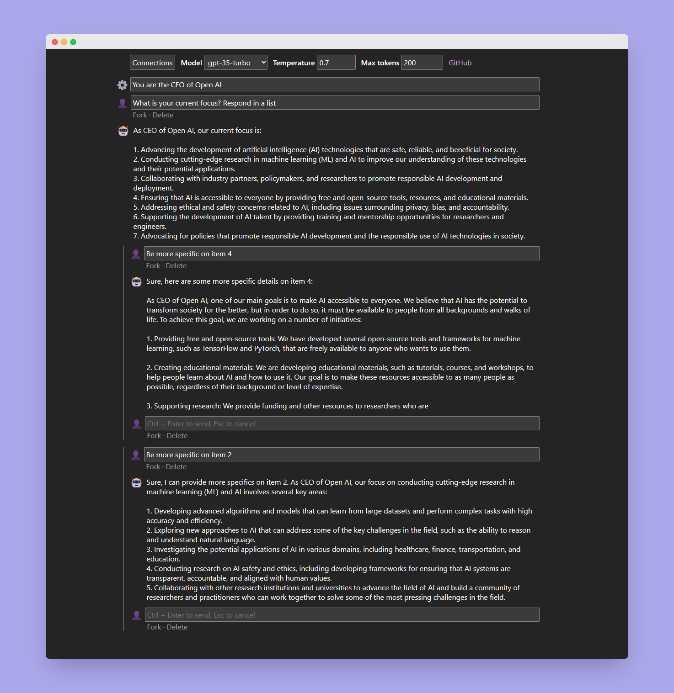

# Iter

A minimalist frontend for Azure OpenAI Chat models, optimized for rapid prompt iteration.

- **🔒 Privacy first**: Credentials are stored in your browser. All requests directly sent to API with no middleman. Absolutely no tracking.
- **⏰ Fork-able history**: Explore different variantions of the prompt that share the same history.
- **🔀 Parallel chat**: Gain extra productivity by streaming chat response from multiple submissions at the same time
- **⚡ API endpoint and model hot-swap**: Switch between different APIs and models without losing any chat progress
- **🦉 Adapts to OS/Browser default theme**: Dark theme for happy night owls
- **💅 Markdown parser**: Built-in syntax highlight and copy button for code blocks
- **🧭 Artifacts**: Run code blocks for SVG, HTML, Mermaid, TypeScript, and React in JSX

\*This project is still an early experiment. Please share ideas, feedback, or file bugs via GitHub Issues page. Thank you!

